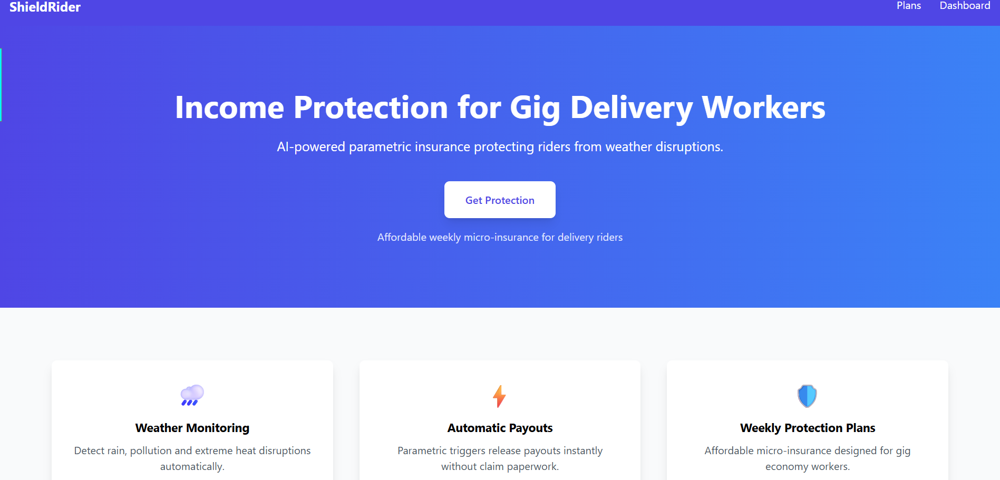
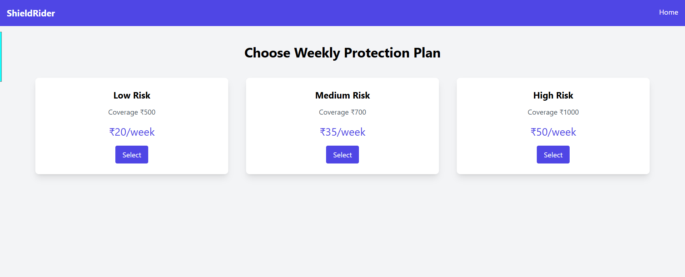
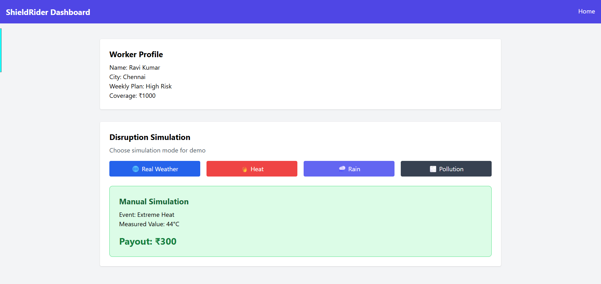

# ShieldRider – Gig Worker Income Protection Platform


## 🚀 Try It Out

👉 **Open the Live Prototype**  
https://varshilworld.github.io/Shield_Rider/frontend/index.html


## 🚀 Prototype – AI Powered License

A smart parametric insurance platform designed to protect gig workers such as food delivery riders from income loss caused by environmental and social disruptions.

---

## 🎬 Demo

**Demo Video:** [https://drive.google.com/file/d/1VhG5So33ppznQhQuhWPvAFH4ZdGT8yKV/view?usp=sharing](https://drive.google.com/file/d/1VhG5So33ppznQhQuhWPvAFH4ZdGT8yKV/view?usp=sharing)

**Prototype Screenshots:**
### Prototype Screenshots








---

## 📑 Table of Contents

1. Project Overview
2. Our Solution
3. Delivery Worker Persona
4. User Scenarios
5. Challenges Faced by Gig Workers
6. Application Workflow
7. Weekly Premium Model
8. Parametric Triggers
9. Platform Choice – Progressive Web App (PWA)
10. Tech Stack
11. System Architecture
12. Business Viability
13. Adversarial Defense & Anti-Spoofing Strategy
14. Expected Impact
15. Market Opportunity
16. Product Roadmap
17. Getting Started
18. Project Structure
19. Startup Vision
20. Conclusion
21. Contributors

---

## 📌 Project Summary

ShieldRider is an **AI-powered parametric insurance platform** built to protect food delivery workers from sudden income loss caused by weather disruptions, pollution, strikes, or government restrictions.

The system continuously monitors environmental and operational data using external APIs. When predefined disruption thresholds are crossed, the platform automatically triggers insurance claims and sends payouts to affected workers.

The goal is to create an **affordable weekly micro-insurance system** that aligns with gig workers’ earning cycles and provides a reliable financial safety net.

---

## 🔎 Problem → Solution Overview

```
Gig Worker Reality Today
        |
        v
+-----------------------------+
| External Disruptions        |
| - Heavy Rain                |
| - Heat Waves                |
| - Pollution                 |
| - Strikes / Curfews         |
+--------------+--------------+
               |
               v
+-----------------------------+
| Delivery Orders Drop        |
| Workers Cannot Complete     |
| Enough Deliveries           |
+--------------+--------------+
               |
               v
+-----------------------------+
| Income Loss for Workers     |
| No Compensation Mechanism   |
+--------------+--------------+
               |
               v
=========== ShieldRider ==========
               |
               v
+-----------------------------+
| Parametric Insurance Model  |
| Detect Disruptions via APIs |
| Automatically Trigger Claim |
| Instant UPI Payout          |
+-----------------------------+
```

---

# 1. 🔵 Project Overview

## Problem Statement

Gig economy workers such as food delivery riders depend heavily on daily orders for income. However, their earnings can drop significantly due to factors beyond their control such as heavy rain, extreme heat, air pollution, strikes, or traffic restrictions.

These disruptions directly affect the number of deliveries completed, resulting in unstable income and financial insecurity.

## Objective of the Solution

The objective of this project is to build a smart parametric insurance platform that protects gig workers from unexpected income loss.

The system automatically monitors environmental and operational conditions and provides compensation when predefined disruption triggers occur.

---

# 2. 🔵 Our Solution

ShieldRider is a digital platform that offers **affordable weekly micro-insurance** for gig workers.

The platform monitors real-time environmental and operational data such as weather conditions, air pollution levels, and city disruptions.

### Key Features

* Weekly micro-insurance plans for gig workers
* Automatic claim processing using parametric triggers
* Real-time monitoring of environmental and operational risks
* AI-driven risk prediction and premium adjustment
* Simple and accessible web-based platform

### ⚡ How ShieldRider is Different from Traditional Insurance

* **Automatic Claims:** No manual claim filing; payouts are triggered automatically.
* **Instant Payouts:** Compensation is processed within minutes.
* **Gig Worker Focused:** Weekly low-cost plans designed for delivery workers’ income patterns.
* **Real-Time Data Driven:** Uses live weather, AQI, and disruption data.
* **Covers Income Loss:** Protects against loss of daily earnings.
* **AI-Based Decisions:** Risk scoring, premium calculation, fraud detection.
* **Minimal Paperwork:** Fully digital system.

---

# 3. 🔵 Delivery Worker Persona — Example: Ravi

### Selected Delivery Segment

Food delivery services such as Zomato, Swiggy, and other gig-based food delivery platforms.

### Persona Description

Ravi is a 27-year-old food delivery rider working in a busy metropolitan city.

He earns between **₹600 and ₹1000 per day** depending on demand and working conditions.

### Daily Workflow

* Logs into the delivery platform application
* Receives order notifications
* Picks up food from restaurants
* Delivers orders to customers
* Repeats the process throughout the day

### Income Loss Scenario

During severe rain or pollution events Ravi may complete far fewer deliveries, reducing income by **up to 50%**.

---

# 4. 🔵 User Scenarios

## Scenario 1 – Chennai Monsoon (Heavy Rainfall)

| Time     | Event                                          |
| -------- | ---------------------------------------------- |
| 11:17 AM | OpenWeatherMap API detects 67mm rainfall       |
| 11:18 AM | Trigger condition rainfall ≥ 40mm / 3 hrs TRUE |
| 11:19 AM | System identifies active policyholders         |
| 11:21 AM | AI fraud module confirms GPS location          |
| 11:23 AM | Fraud score 0.08 – auto approved               |
| 11:29 AM | ₹500 credited to Ravi’s UPI                    |

**Total time from trigger to payout: 12 minutes**

---

## Scenario 2 – Chennai Bandh (Social Disruption)

| Time    | Event                          |
| ------- | ------------------------------ |
| 6:45 AM | Civic alert feed detects bandh |
| 6:46 AM | Zones flagged as disrupted     |
| 6:48 AM | Policyholders identified       |
| 6:50 AM | Fraud check completed          |
| 6:55 AM | ₹500 credited                  |

---

## Scenario 3 – Hyderabad Heat Wave

| Time     | Event                       |
| -------- | --------------------------- |
| 12:10 PM | Heat index API reads 44°C   |
| 12:12 PM | Trigger heat index ≥ 42°C   |
| 12:14 PM | Partial disruption detected |
| 12:15 PM | Payout calculated ₹225      |
| 12:22 PM | ₹225 credited               |

---

# 5. 🔵 Challenges Faced by Gig Workers

| Disruption Type            | Avg. Days/Year | Daily Income Lost | Annual Exposure |
| -------------------------- | -------------- | ----------------- | --------------- |
| Heavy rainfall             | 18–22          | ₹600–900          | ₹11,000–19,800  |
| Extreme heat               | 8–12           | ₹300–500          | ₹2,400–6,000    |
| Strike                     | 3–6            | ₹600–900          | ₹1,800–5,400    |
| Flash flood / zone closure | 5–8            | ₹400–700          | ₹2,000–5,600    |

Workers face **8–20% annual income exposure** due to disruptions.

---

# 6. 🔵 Application Workflow

## Phase A – Worker Onboarding

1. Worker accesses the ShieldRider platform
2. OTP login using mobile number
3. Worker selects delivery platform and zone
4. AI calculates personalized premium
5. Worker selects plan and confirms payment
6. Policy activated

## Phase B – Automated Claims Engine

```
Worker Registers on ShieldRider
        |
        v
AI Calculates Risk Score
        |
        v
Weekly Micro‑Insurance Plan Activated
        |
        v
System Monitors Weather / Pollution / Alerts
        |
        v
Disruption Detected in Worker Zone
        |
        v
Parametric Trigger Activated
        |
        v
Fraud Detection Check
        |
        v
Automatic Payout Sent via UPI
```

---

7. 🔵 Weekly Premium Model
💰 Premium Structure
Risk Level	Weekly Premium	Max Weekly Coverage
Low Risk Area	₹20	₹500
Medium Risk Area	₹35	₹700
High Risk Area	₹50	₹1000

Risk levels are determined using AI analysis of:

Historical weather patterns

Flood-prone zones

Pollution levels

Frequency of disruptions

🧠 Dynamic Premium Calculation

Premiums are personalized based on worker income, risk level, and selected coverage plan.

Factors:

Risk Factor (0.02 – 0.06) → based on environmental risk

Coverage Factor (1.0 – 1.5) → based on plan (Basic, Standard, Premium)

📊 Formula
Monthly Premium = Monthly Income × Risk Factor × Coverage Factor  
Weekly Premium = Monthly Premium ÷ 4
📌 Example

For ₹20,000 income, Medium Risk (0.04), Standard Plan (1.2):

Monthly Premium = ₹960  
Weekly Premium = ₹240
🛡️ Coverage Model

Coverage compensates income loss during disruptions.

Example:
If a worker earns ₹800/day and cannot work due to a disruption, the system automatically provides compensation based on the selected plan.

---

# 8. 🔵 Parametric Triggers

## Parametric Insurance Concept

```
Traditional Insurance
Worker files claim
        |
        v
Manual verification
        |
        v
Approval after days/weeks

ShieldRider Parametric Insurance
External Data Trigger
        |
        v
System Detects Event
        |
        v
Automatic Claim Generation
        |
        v
Instant UPI Payout
```

### Weather Triggers

* Rainfall > 50mm
* Extreme heat > 42°C

### Pollution Triggers

* AQI above 400

### Social Triggers

* Strikes
* Curfews
* Zone closures

## Parametric Trigger Logic Flow

```
External Data APIs
        |
        v
Trigger Monitoring Engine
        |
        v
Check Threshold Conditions
        |
        v
Trigger TRUE?
      /      \
    No        Yes
    |          |
    v          v
Continue   Identify Policies
Monitoring
```

---

# 9. 🔵 Platform Choice — Progressive Web App (PWA)

Benefits:

* No app download required
* Works on Android and iOS
* Push notifications
* Offline capabilities

---

# 10. ⚙ Tech Stack

## Frontend

* HTML
* CSS
* JavaScript
* React

## Backend

* Python (Flask / FastAPI)
* Node.js (Express)

## Machine Learning

* Logistic Regression
* Random Forest
* Isolation Forest

## Database

* Firebase / MongoDB

---

# 11. 🔵 System Architecture

## Clean Architecture Diagram

```
graph TD
A[Worker Mobile Browser / PWA] --> B[Frontend Web App]
B --> C[Backend API Layer]
C --> D[Policy & Claims Manager]
C --> E[AI Risk Prediction Engine]
C --> F[Fraud Detection Engine]
E --> G[Risk Score Calculation]
F --> H[Anomaly Detection]
C --> I[External APIs]
D --> M[Payout Engine]
M --> N[UPI / Payment Gateway]
```

## ASCII Architecture Diagram

```
        +-------------------+
        |   Worker (User)   |
        +---------+---------+
                  |
                  v
        +-------------------+
        |  Web App (React)  |
        +---------+---------+
                  |
                  v
        +-----------------------------+
        |        Backend API          |
        +-----+-----------+-----------+
              |           |
              v           v
     +---------------+   +------------------+
     |  AI Risk      |   | Fraud Detection  |
     |  Engine       |   | Engine           |
     +-------+-------+   +--------+---------+
             |                    |
             v                    v
       +----------------------------------+
       |      Policy & Claims Manager     |
       +----------------+-----------------+
                        |
                        v
               +-------------------+
               | Payout System     |
               | (UPI / Sandbox)   |
               +-------------------+
```

This architecture allows the platform to monitor disruptions, evaluate risk using AI models, and automatically trigger payouts when disruption conditions are met.
## 12. 🔐 Adversarial Defense & Anti-Spoofing Strategy

### 🚨 Problem Context

Modern parametric insurance platforms are vulnerable to coordinated fraud attacks where malicious users spoof GPS locations to falsely claim payouts during disruption events.

In a realistic attack scenario, groups of delivery workers can use GPS spoofing tools to fake their presence in high-risk zones, triggering automated payouts without actually being affected.

To ensure system integrity, ShieldRider implements a multi-layered adversarial defense architecture that goes beyond simple location verification.

---

### I. 🔍 Differentiation Strategy

**Genuine Worker vs Spoofed Actor**

ShieldRider uses a multi-signal trust scoring system instead of relying on a single GPS input.

Each worker is assigned a **Dynamic Trust Score** based on behavioral, environmental, and device-level signals.

**Core Idea:**
A real delivery worker leaves a consistent digital and behavioral footprint, while a spoofed actor creates inconsistent and isolated signals.

#### ✅ Genuine Worker Characteristics

* Continuous movement patterns (pickup → delivery routes)
* Stable GPS drift patterns (natural inaccuracies)
* Active app interaction during working hours
* Realistic speed and route transitions
* Network fluctuations consistent with weather conditions

#### ❌ Spoofed Actor Patterns

* Static or perfectly stable GPS location
* Sudden jumps to high-risk zones
* No movement history before disruption
* Unrealistic travel speeds ("teleporting" effect)
* Identical patterns across multiple users (fraud clusters)

### 🧠 Decision Logic

| Classification | System Response    |
| -------------- | ------------------ |
| ✅ Trusted      | Instant payout     |
| ⚠️ Suspicious  | Delayed / Verified |
| ❌ Fraudulent   | Blocked            |

---

### II. 📊 Data Signals Used Beyond GPS

To detect advanced spoofing attacks, ShieldRider analyzes multiple data layers:

#### 📍 Location Intelligence

* GPS coordinates (raw)
* Location history (last 24–48 hours)
* Movement trajectory consistency
* Speed and acceleration patterns

#### 📱 Device & Sensor Data

* Device ID consistency
* Accelerometer & gyroscope data (movement validation)
* Battery usage patterns
* App foreground/background activity

#### 🌐 Network Intelligence

* IP address consistency
* Network type (WiFi vs Mobile Data)
* Sudden IP jumps across regions
* Signal strength anomalies during disruption

#### 🧍 Behavioral Patterns

* Login frequency & timing
* Delivery activity history
* Order completion logs (if integrated)
* App interaction patterns

#### 🧠 Fraud Pattern Detection

* Cluster analysis (multiple users in same fake zone)
* Synchronized claim timing
* Repeated claims under similar conditions
* Peer similarity scoring

---

### III. ⚖️ UX Balance — Fairness for Honest Workers

A strong anti-fraud system must not penalize genuine workers.

ShieldRider follows a **graceful degradation approach**.

#### 🔐 Multi-Device Login & Account Sharing Prevention

* **Single Active Session:** Only one device can be active at a time. New login logs out previous sessions.
* **Device Binding:** Accounts are linked to a primary device; new devices require OTP verification.
* **Geo-Location Check:** Simultaneous logins from distant locations are flagged and blocked.
* **Location History Tracking:** Sudden jumps to high-risk zones without movement history are treated as suspicious.
* **Trust Score System:** User behavior (device, location, activity) determines payout eligibility.
* **OTP During Payout:** Re-verification ensures only the genuine user can approve payouts.

This prevents account sharing, detects multi-device fraud, and ensures payouts are made only to genuine workers.

#### 🟢 Trusted Users

* Instant payouts (no friction)
* No additional verification

#### 🟡 Suspicious Users (Edge Cases)

Triggered when:

* Poor network due to weather
* Temporary GPS inconsistencies

System Response:

* Soft verification (OTP / activity check)
* Slight payout delay (few minutes)
* Passive confirmation (minimal friction)

#### 🔴 High-Risk Users

Triggered when:

* Multiple fraud signals detected
* Cluster fraud pattern observed

System Response:

* Payout temporarily held
* Flagged for deeper AI verification
* Manual review only if necessary

---

### 🎯 Key Principle

> "Minimize friction for honest users, maximize resistance for malicious actors."

---

### 🧠 AI/ML Defense Layer (Future Integration)

The system can be extended using:

* Anomaly Detection Models (Isolation Forest)
* Sequence Models (LSTM for movement patterns)
* Graph-based Fraud Detection (cluster detection)
* Reinforcement Learning for adaptive thresholds

---

### 🏗️ Anti-Spoofing Architecture Diagram

```
               +----------------------+
                |   Worker Device      |
                +----------+-----------+
                           |
                           v
                +----------------------+
                | Data Collection Layer|
                | GPS, Sensors, Device |
                +----------+-----------+
                           |
                           v
                +----------------------+
                | Feature Processing   |
                | Movement, Behavior   |
                +----------+-----------+
                           |
                           v
                +----------------------+
                | Trust Score Engine   |
                | (Multi-Signal AI)    |
                +----------+-----------+
                           |
        -----------------------------------------
        |                   |                   |
        v                   v                   v
+---------------+   +---------------+   +----------------+
| Trusted       |   | Suspicious    |   | Fraudulent     |
| (Instant Pay) |   | (Soft Check)  |   | (Blocked)      |
+---------------+   +---------------+   +----------------+

                           |
                           v
                +----------------------+
                |   Payout Engine      |
                +----------------------+
```

---

## 13. 💰 Business Viability

### Revenue Model

* Weekly insurance premiums paid by workers
* Partnerships with delivery platforms
* Data-driven risk insights for insurers

### Risk Distribution

Risk is managed through:

* AI-based premium adjustment
* Geographic risk analysis
* Limiting payouts to predefined thresholds

---

### ⚡ How ShieldRider is Different from Traditional Insurance

| Feature              | ShieldRider Advantage                                   |
| -------------------- | ------------------------------------------------------- |
| Automatic Claims     | No manual claim filing; payouts triggered automatically |
| Instant Payouts      | Compensation processed within minutes                   |
| Gig Worker Focus     | Weekly low-cost plans designed for delivery workers     |
| Real-Time Data       | Uses live weather, AQI, and disruption data             |
| Income Loss Coverage | Protects daily earnings against disruptions             |
| AI-Based Decisions   | Risk scoring, premium calculation, fraud detection      |
| Minimal Paperwork    | Fully digital system                                    |

---

## 14. 🌍 Expected Impact

### Benefits for Workers

* Financial protection against income loss
* Affordable weekly insurance plans
* Automated claims with no paperwork
* Faster payouts during disruptions

### Benefits for Insurers

* Efficient automated claim processing
* Reduced fraud through AI monitoring
* Scalable micro-insurance products

---

## 15. 📈 Market Opportunity

| Metric                       | Estimate               |
| ---------------------------- | ---------------------- |
| Gig workers in India         | 7–8 million+           |
| Delivery & logistics workers | Millions across cities |
| Growth rate                  | Rapid expansion        |

---

## 16. 🛣 Product Roadmap

### Phase 1 – Prototype

* Core parametric insurance concept
* Basic AI risk scoring
* Parametric trigger simulation
* Mock payout system

### Phase 2 – Pilot

* Real weather & pollution APIs
* Integration with delivery platforms
* Worker mobile interface

### Phase 3 – Scale

* Nationwide risk modeling
* Real insurance partnerships
* Full payment integration

---

## 17. 🧪 Getting Started

### Clone the Repository

```
git clone https://github.com/your-repo/shieldrider.git
cd shieldrider
```

### Install Backend Dependencies

```
pip install -r requirements.txt
```

### Start Backend Server

```
python app.py
```

### Open Frontend

Open `frontend/index.html` or run the React development server.

---

## 18. 📂 Project Structure

```
project-root
│
├── frontend/
│   ├── dashboard
│   ├── plan-selection
│   └── alerts
│
├── backend/
│   ├── api
│   ├── disruption-engine
│   └── payout-handler
│
├── ai-models/
│   ├── risk-prediction
│   ├── premium-model
│   └── fraud-detection
│
├── database/
│   └── schema
│
├── docs/
│   └── architecture
│
└── README.md
```

---

## 19. 🚀 Startup Vision

ShieldRider aims to build a scalable micro-insurance platform capable of protecting millions of gig workers across India from income disruptions caused by environmental and social events.

### Long-term Vision

* Provide affordable insurance for millions of delivery workers
* Partner with gig platforms
* Expand to ride-hailing and logistics workers
* Build a nationwide disruption-risk intelligence system

---

## 20. 🧾 Conclusion

ShieldRider presents a practical and scalable solution to a critical gap in the gig economy — the lack of financial protection for delivery workers against external disruptions.

By leveraging a parametric insurance model, the platform removes the need for manual claims and enables fast, automated payouts based on real-world data.

In this Phase‑1 prototype, we demonstrate the core concept using real-time weather integration, predefined disruption triggers, and a working payout simulation system.

The platform also incorporates:

* AI-driven risk prediction
* Dynamic premium pricing
* Robust fraud detection
* Multi-layer adversarial defense

These capabilities ensure the system remains resilient against sophisticated attacks such as GPS spoofing and coordinated fraud.

Overall, ShieldRider has the potential to evolve into a full-scale micro-insurance platform protecting millions of gig workers, improving financial stability and building trust within the gig economy ecosystem.

---

## 21. 👥 Contributors

### Team Members

* VARSHIL GUPTA
* HARSH KUMAR SONI
* HARSHINI SHORI
